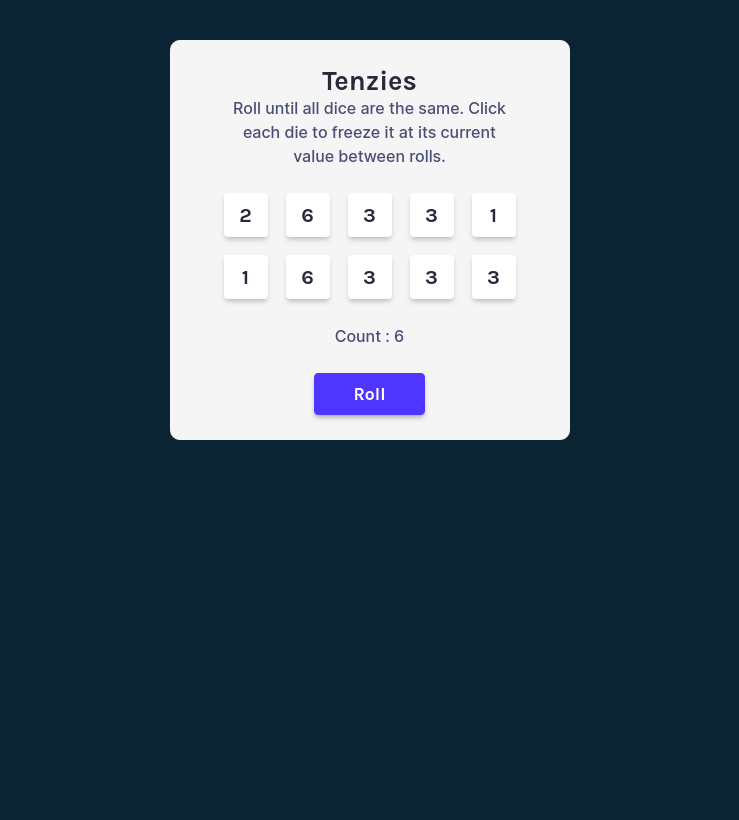

# Tenzies Game 

Szybka i wciągająca gra kościana zbudowana w oparciu o React. Celem gracza jest wylosowanie takich samych wartości na wszystkich 10 kostkach w jak najmniejszej liczbie rzutów. Gra zawiera licznik rzutów, efekty wizualne po wygranej oraz podstawowe usprawnienia z zakresu dostępności (ARIA).

## Podgląd projektu

## Technologie

* **React 19**
* **Vite**
* **Tailwind CSS**
* **Nanoid**
* **React Confetti**

## Zasady gry

1. Gra rozpoczyna się z 10 losowymi kostkami.
2. Kliknięcie na wybraną kostkę "zamraża" ją (`isHeld`), co zabezpiecza ją przed kolejnym rzutem.
3. Kliknięcie przycisku **Roll** losuje nowe wartości dla pozostałych, niezablokowanych kostek.
4. Gra kończy się sukcesem, gdy wszystkie kostki mają tę samą wartość.
